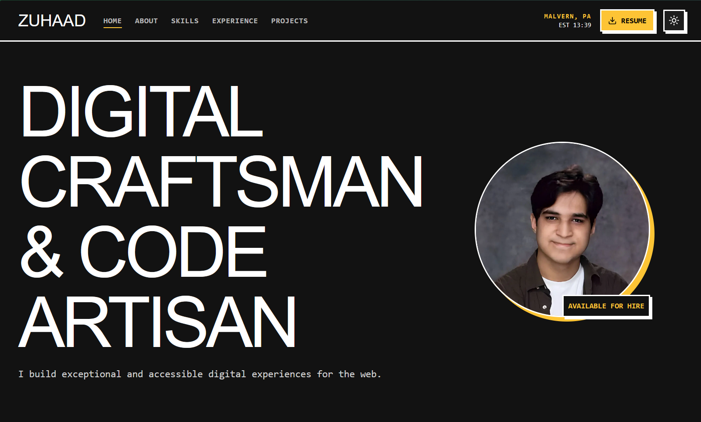

# Zuhaad Portfolio

A modern, animation-rich developer portfolio built with Next.js 14, TypeScript, and Tailwind CSS to showcase Zuhaad''s work as a digital craftsman and full-stack engineer.

## Table of Contents
- [Overview](#overview)
- [Key Features](#key-features)
- [Tech Stack](#tech-stack)
- [Getting Started](#getting-started)
- [Environment Variables](#environment-variables)
- [Available Scripts](#available-scripts)
- [Project Structure](#project-structure)
- [Content & Customization](#content--customization)
- [Deployment](#deployment)
- [Accessibility & Performance](#accessibility--performance)
- [License](#license)

## Overview

The portfolio leverages Next.js 14''s App Router and TypeScript-first tooling to deliver a responsive, accessible, and immersive browsing experience. Motion design is powered by Framer Motion, while Tailwind CSS drives a cohesive visual language across light and dark modes.



## Key Features
- Modern single-page layout with anchored navigation and smooth section transitions.
- Global light/dark theming managed by `next-themes`, with animated toggle feedback.
- Intersection Observer-driven reveal animations and micro-interactions powered by Framer Motion.
- Rich projects gallery with modal-style deep dives, per-project technology badges, and external links.
- Live GitHub activity widget (GraphQL) that surfaces contribution heatmaps, repositories, and events.
- Downloadable resume CTA and location/time display tailored for quick recruiter context.
- Tailwind-based design tokens for consistent brutalist-inspired styling and easy brand customization.

## Tech Stack
- Next.js 14 (App Router)
- React 18 + TypeScript 5
- Tailwind CSS 3 + PostCSS
- Framer Motion 12
- next-themes for client-side theming
- Lucide React icon set

## Getting Started

### Prerequisites
- Node.js 18.17 or newer (required by Next.js 14)
- npm 9+ (bundled with recent Node releases)

### Installation
```bash
npm install
```

### Local Development
```bash
npm run dev
```
The development server runs at `http://localhost:3000`.

## Environment Variables

The GitHub activity widget requires a personal access token with `read:user` and `public_repo` scopes.

1. Duplicate `.env.local.example` to `.env.local`.
2. Replace `NEXT_PUBLIC_GITHUB_TOKEN` with your token.
3. Restart the dev server so Next.js picks up the new environment variable.

> Keep the token private; even though it is exposed to the client, use a low-privilege key dedicated to public data.

## Available Scripts

| Command | Description |
| ------- | ----------- |
| `npm run dev` | Start the development server with hot reloading. |
| `npm run build` | Create an optimized production build. |
| `npm run start` | Serve the production build locally. |
| `npm run lint` | Run ESLint across the codebase. |

## Project Structure
```
.
|- public/
|  |- README_RESUME.md
|- src/
|  |- app/
|  |  |- layout.tsx
|  |  |- page.tsx
|  |- components/
|  |  |- about-section.tsx
|  |  |- footer.tsx
|  |  |- github-activity.tsx
|  |  |- header.tsx
|  |  |- hero-section.tsx
|  |  |- projects-section.tsx
|  |  |- skills-section.tsx
|  |- hooks/
|  |  |- useScrollReveal.ts
|  |- utils/
|- .env.local.example
|- tailwind.config.ts
|- tsconfig.json
`- package.json
```

## Content & Customization
- Update hero messaging and badge text in `src/components/hero-section.tsx`.
- Adjust bio copy and capabilities in `src/components/about-section.tsx`.
- Curate skills by editing the arrays in `src/components/skills-section.tsx`.
- Manage project cards and modal content via the `projects` array in `src/components/projects-section.tsx`.
- Point social icons to live profiles in `src/components/footer.tsx`.
- Replace `/resume.pdf` in `public/` so the header download link surfaces the latest resume.
- Tune brand colors, typography, and shadows in `tailwind.config.ts` and `src/app/globals.css`.

## Deployment

The project is optimized for Vercel, but any Node-capable host works:

1. Push the repository to your Git provider.
2. Create a new Vercel project and import the repo.
3. Add `NEXT_PUBLIC_GITHUB_TOKEN` to the Vercel environment.
4. Trigger a production build; Vercel will handle previews, analytics, and ISR.

For self-managed servers, build locally (`npm run build`) and serve with `npm run start`.

## Accessibility & Performance
- Animations gracefully respect `prefers-reduced-motion` via global CSS fallbacks.
- Semantic landmarks (header, main, footer) and keyboard-focused navigation enhance usability.
- Optimized images with Next.js Image component for faster loads and better performance.

## License

This codebase is currently private and all rights are reserved. Contact the author before reusing or redistributing any part of the project.

