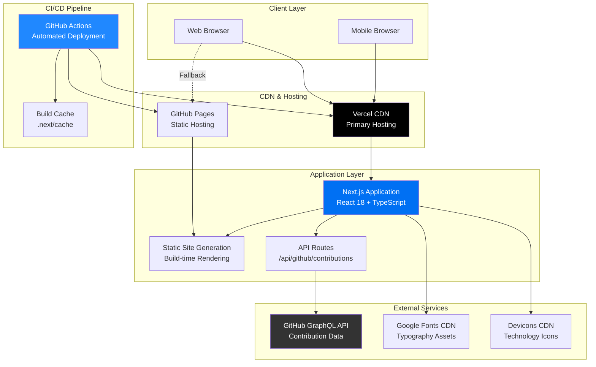
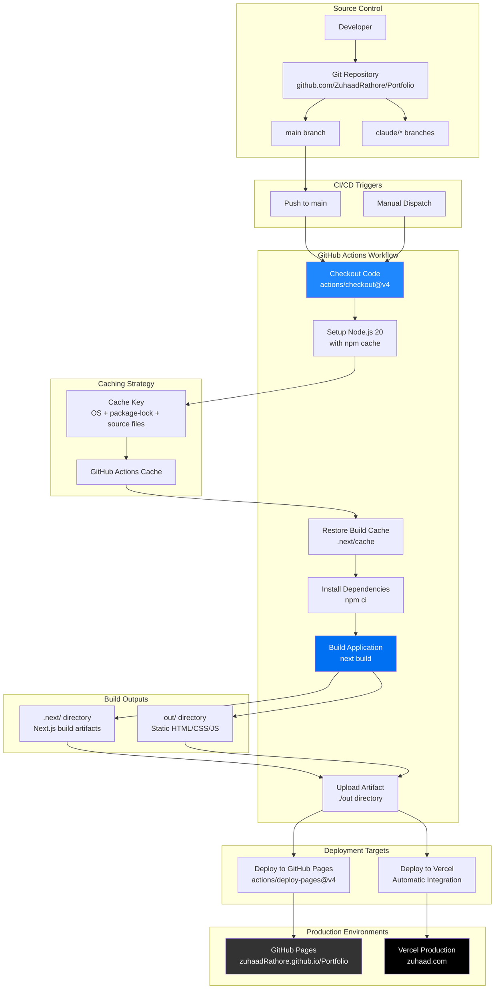
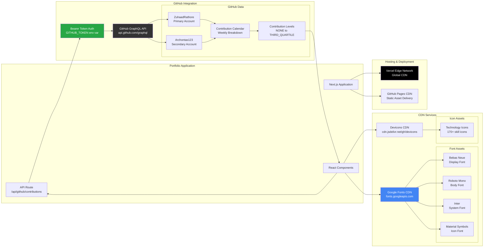
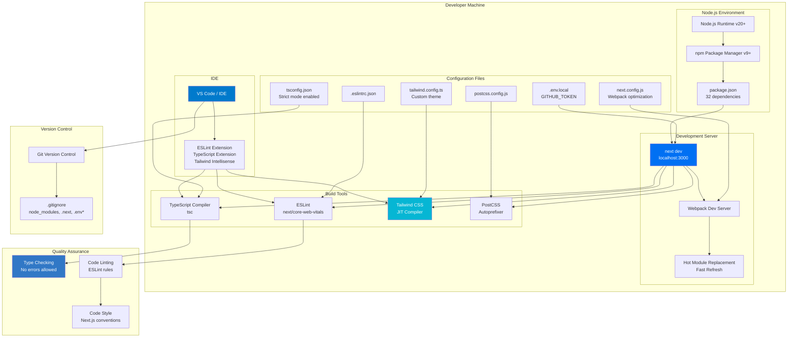

# Portfolio Website - Infrastructure Documentation

## Table of Contents
1. [System Architecture Overview](#system-architecture-overview)
2. [Frontend Architecture](#frontend-architecture)
3. [Build & Deployment Pipeline](#build--deployment-pipeline)
4. [External Integrations](#external-integrations)
5. [Development Environment](#development-environment)
6. [Technology Stack](#technology-stack)

---

## System Architecture Overview

This diagram shows the high-level architecture of the Portfolio Website application, including user interactions, hosting, and external services.



---

## Frontend Architecture

This diagram illustrates the component structure, state management, and rendering flow of the Next.js application.

```mermaid
graph TB
    subgraph "App Router (Next.js 14)"
        Layout[app/layout.tsx<br/>Root Layout]
        Home[app/page.tsx<br/>Home Page]
        ProjectDetail[app/projects/[id]/page.tsx<br/>Dynamic Project Pages]
        APIRoute[app/api/github/contributions/route.ts<br/>GitHub API Proxy]
    end

    subgraph "Component Tree"
        ThemeProvider[ThemeProvider<br/>next-themes Context]
        Header[Header Component<br/>Navigation + Theme Toggle]

        Hero[Hero Section<br/>Full-screen Landing]
        About[About Section<br/>Developer Bio]
        Skills[Skills Section<br/>Technology Grid]
        Experience[Experience Section<br/>Timeline Carousel]
        Projects[Projects Section<br/>Featured Projects Gallery]
        GitHubActivity[GitHub Activity<br/>Contribution Heatmap]
        Footer[Footer<br/>Social Links]
    end

    subgraph "Hooks & Utilities"
        ScrollReveal[useScrollReveal Hook<br/>Intersection Observer]
        FramerMotion[Framer Motion<br/>Animation Engine]
    end

    subgraph "Styling Layer"
        Tailwind[Tailwind CSS<br/>Utility Classes]
        GlobalCSS[globals.css<br/>Custom Styles]
        Theme[Theme Config<br/>Light/Dark Mode]
    end

    subgraph "Data Flow"
        GitHub[GitHub GraphQL API]
        ContributionData[Contribution Data<br/>Merged from 2 accounts]
    end

    Layout --> ThemeProvider
    ThemeProvider --> Home
    ThemeProvider --> ProjectDetail

    Home --> Header
    Home --> Hero
    Home --> About
    Home --> Skills
    Home --> Experience
    Home --> Projects
    Home --> GitHubActivity
    Home --> Footer

    GitHubActivity --> APIRoute
    APIRoute --> GitHub
    GitHub --> ContributionData
    ContributionData --> GitHubActivity

    Hero --> ScrollReveal
    About --> ScrollReveal
    Skills --> ScrollReveal
    Experience --> ScrollReveal
    Projects --> ScrollReveal

    ScrollReveal --> FramerMotion

    Header --> Theme
    ThemeProvider --> Theme
    Theme --> Tailwind
    GlobalCSS --> Tailwind

    style Layout fill:#0070f3,color:#fff
    style ThemeProvider fill:#61dafb,color:#000
    style Tailwind fill:#06b6d4,color:#fff
    style GitHub fill:#333,color:#fff
```

---

## Build & Deployment Pipeline

This diagram shows the complete CI/CD workflow from code commit to production deployment.



### Build Pipeline Details

**Build Steps Breakdown:**

1. **Code Checkout** (actions/checkout@v4)
   - Fetches repository code
   - Checks out specific branch

2. **Node.js Setup** (v20)
   - Installs Node.js runtime
   - Configures npm cache for faster builds

3. **Cache Restoration**
   - Key: `${{ runner.os }}-nextjs-${{ hashFiles('**/package-lock.json') }}-${{ hashFiles('**.[jt]s', '**.[jt]sx') }}`
   - Restores `.next/cache` if available
   - Speeds up builds by ~30-50%

4. **Dependency Installation**
   - `npm ci` (clean install)
   - Uses lockfile for reproducible builds

5. **Application Build**
   - `next build` command
   - Static site generation
   - Image optimization disabled for static export
   - Output: `out/` directory

6. **Artifact Upload**
   - Uploads `out/` directory
   - Used by deployment step

7. **Deployment**
   - **GitHub Pages**: actions/deploy-pages@v4
   - **Vercel**: Automatic via Vercel GitHub integration

---

## External Integrations

This diagram shows all external services and APIs integrated into the application.



### Integration Details

**GitHub GraphQL API:**
- **Endpoint**: `https://api.github.com/graphql`
- **Authentication**: Bearer token (server-side only)
- **Rate Limit**: 5,000 requests/hour (authenticated)
- **Data Fetched**:
  - User contribution calendar (52 weeks)
  - Daily contribution counts
  - Contribution levels (0-4 scale)
- **Accounts**: 2 GitHub usernames merged
  - `ZuhaadRathore` (primary)
  - `Archontas123` (secondary)

**Google Fonts CDN:**
- **Fonts Loaded**:
  - Bebas Neue (display headings)
  - Roboto Mono (body text, code)
  - Inter (system font)
  - Material Symbols Outlined (icons)
- **Optimization**: Preconnect hints for faster loading

**Devicons CDN:**
- **Purpose**: Technology skill icons
- **Source**: `cdn.jsdelivr.net/gh/devicons/devicon`
- **Icons**: 170+ technology logos

---

## Development Environment

This diagram illustrates the local development setup and workflow.



### Development Workflow

**Setup Steps:**
```bash
# 1. Clone repository
git clone https://github.com/ZuhaadRathore/Portfolio.git
cd Portfolio

# 2. Install dependencies
npm install

# 3. Configure environment variables
cp .env.local.example .env.local
# Edit .env.local and add your GITHUB_TOKEN

# 4. Start development server
npm run dev
# Server runs at http://localhost:3000
```

**Available Scripts:**
- `npm run dev` - Start development server with hot reload
- `npm run build` - Create production build
- `npm run start` - Serve production build locally
- `npm run lint` - Run ESLint checks

**Development Features:**
- **Hot Module Replacement**: Instant updates without full page reload
- **Fast Refresh**: Preserves component state during edits
- **Type Checking**: Real-time TypeScript error detection
- **ESLint Integration**: Code quality enforcement
- **Tailwind IntelliSense**: Class name autocomplete
- **Source Maps**: Debug original TypeScript code

---

## Technology Stack

### Core Framework
| Technology | Version | Purpose |
|------------|---------|---------|
| Next.js | 14.2.13 | React framework with SSG/SSR |
| React | 18.x | UI component library |
| TypeScript | 5.x | Type-safe JavaScript |
| Node.js | 20+ | JavaScript runtime |

### Styling & UI
| Technology | Version | Purpose |
|------------|---------|---------|
| Tailwind CSS | 3.4.1 | Utility-first CSS framework |
| PostCSS | 8.x | CSS transformations |
| Autoprefixer | 10.4.21 | Vendor prefix automation |
| Framer Motion | 12.23.22 | Animation library |
| Lucide React | 0.446.0 | Icon components |
| next-themes | 0.3.0 | Dark mode management |

### Development Tools
| Technology | Version | Purpose |
|------------|---------|---------|
| ESLint | 8.x | Code quality linting |
| Git | 2.x+ | Version control |
| GitHub Actions | N/A | CI/CD automation |

### Hosting & Deployment
| Service | Purpose | URL |
|---------|---------|-----|
| Vercel | Primary hosting | https://zuhaad.com |
| GitHub Pages | Fallback hosting | https://zuhaadRathore.github.io/Portfolio |
| GitHub Actions | Build automation | N/A |

### External Services
| Service | Purpose | Endpoint |
|---------|---------|----------|
| GitHub GraphQL API | Contribution data | https://api.github.com/graphql |
| Google Fonts | Typography | https://fonts.googleapis.com |
| Devicons CDN | Technology icons | https://cdn.jsdelivr.net |

---

## File Structure Reference

```
/home/user/Portfolio/
├── .github/workflows/nextjs.yml          # CI/CD pipeline
├── src/
│   ├── app/
│   │   ├── layout.tsx                    # Root layout
│   │   ├── page.tsx                      # Home page
│   │   ├── globals.css                   # Global styles
│   │   ├── api/github/contributions/route.ts  # GitHub API proxy
│   │   └── projects/[id]/page.tsx        # Project details
│   ├── components/                       # React components
│   └── hooks/useScrollReveal.ts          # Custom hooks
├── public/                               # Static assets
├── docs/infrastructure/                  # Infrastructure docs
├── package.json                          # Dependencies
├── next.config.js                        # Next.js config
├── tailwind.config.ts                    # Tailwind theme
├── tsconfig.json                         # TypeScript config
├── postcss.config.js                     # PostCSS config
├── .eslintrc.json                        # ESLint rules
├── .env.local.example                    # Environment template
└── README.md                             # Project documentation
```

---

## Environment Variables

| Variable | Scope | Required | Purpose |
|----------|-------|----------|---------|
| `GITHUB_TOKEN` | Server-side | Yes | GitHub API authentication |

**Setup:**
1. Create token at: https://github.com/settings/tokens
2. Required scope: `read:user`
3. Add to `.env.local` file
4. Never commit to version control

---

## Performance Optimizations

1. **Build Time**:
   - Build cache restoration (~30-50% faster builds)
   - npm ci for reproducible installs
   - Webpack code splitting in development

2. **Runtime**:
   - Static site generation (no server rendering)
   - Image optimization via Next.js
   - CSS bundle minification
   - JavaScript code splitting

3. **Loading**:
   - Preconnect to external domains
   - Font display swap
   - Lazy loading for below-fold content
   - Intersection Observer for animations

4. **Caching**:
   - Vercel Edge Network CDN
   - GitHub Actions build cache
   - Browser caching headers

---

## Security Measures

1. **API Security**:
   - Server-side only environment variables
   - Low-privilege GitHub token scope (`read:user`)
   - No sensitive data in client bundles

2. **Build Security**:
   - Locked dependencies (package-lock.json)
   - No executable files in version control
   - .env files in .gitignore

3. **Runtime Security**:
   - Next.js built-in security headers
   - CORS configuration for external APIs
   - Content Security Policy (CSP) ready

---

## Accessibility Features

- Semantic HTML landmarks (`<header>`, `<main>`, `<footer>`)
- ARIA labels on interactive elements
- Keyboard navigation support
- `prefers-reduced-motion` support
- Proper heading hierarchy
- Color contrast compliance (WCAG AA)

---

## Monitoring & Analytics

**Available Integrations:**
- Vercel Analytics (enabled)
- Web Vitals tracking
- Build success/failure notifications via GitHub Actions

---

## Related Documentation

- [README.md](/home/user/Portfolio/README.md) - Project overview and setup
- [.github/workflows/nextjs.yml](/home/user/Portfolio/.github/workflows/nextjs.yml) - CI/CD configuration
- [next.config.js](/home/user/Portfolio/next.config.js) - Next.js configuration
- [tailwind.config.ts](/home/user/Portfolio/tailwind.config.ts) - Theme customization

---

**Last Updated**: 2025-11-14
**Maintained By**: Zuhaad Rathore
**Repository**: https://github.com/ZuhaadRathore/Portfolio
